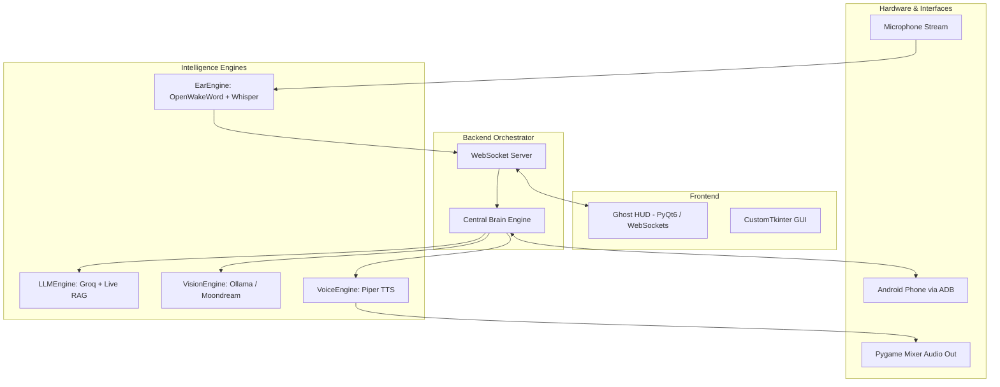
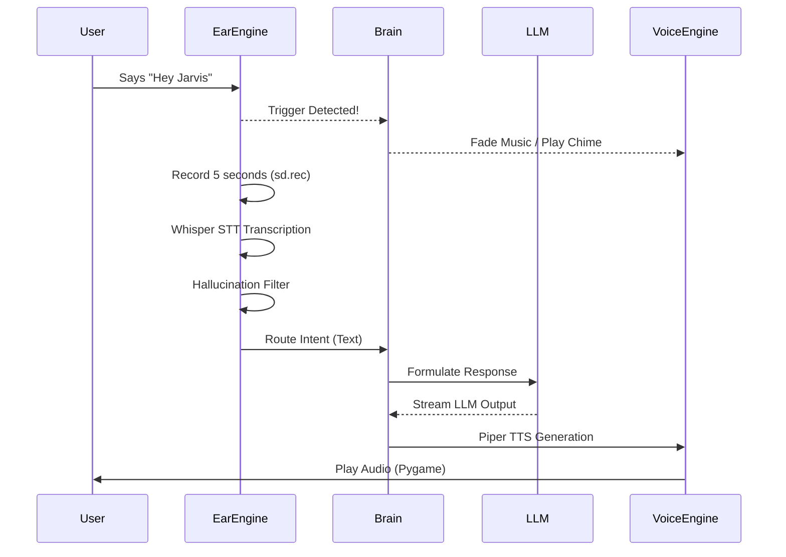
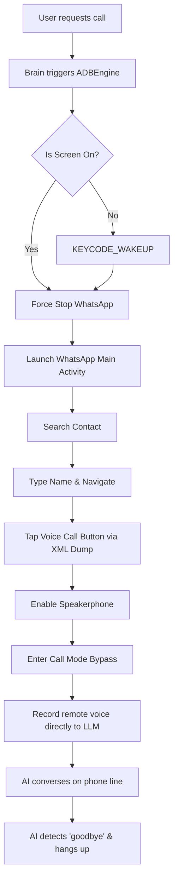

<div align="center">
  


### The Sentinel Engine

[](https://opensource.org/licenses/MIT)
[](https://www.python.org/downloads/)
[](https://microsoft.com/)
[]()
[]()
[]()
[]()


> **Unimagined. Unbound.**<br>
> A fully offline, voice-activated AI assistant for Windows. Powered by Groq, Ollama, Faster-Whisper STT, Piper TTS, and OpenWakeWord — operating completely within your local ecosystem.

</div>

<br>

## 🌐 The Sentinel Matrix (Core Capabilities)

Captain AI is not just another voice assistant; it is a headless apparition living in your machine, offering unparalleled local control and real-time cognition.

- 📞 **Telephonic Symbiosis (ADB Automations)**: Seamlessly bridges to your Android device via USB/ADB. Captain can force-stop WhatsApp, search contacts, initiate VoIP calls, switch to speakerphone, and hold continuous AI-driven conversations over the phone line using the `Groq Llama-3.3-70b` model.
- 👁️ **Active Optics (Vision Intelligence)**: Full screen awareness using `Ollama` and the `moondream` model. Captain can look at your screen, read code, analyze images, and synthesize a summary completely offline.
- ⚡ **Zero-Latency Audio Ecosystem**: A custom pipeline featuring `OpenWakeWord` for local trigger detection ("Hey Jarvis") and `Faster-Whisper` (Int8 CPU) for hyper-fast STT. Responses are spoken through `Piper TTS` using the `en_US-ryan-medium` model, backed by an MD5 hash-based WAV caching system for instant recall.
- 🔍 **Hybrid RAG Retrieval**: Ask questions and watch Captain dynamically scrape DuckDuckGo news and Wikipedia summaries in real-time, injecting verifiable context directly into the LLM prompt to eliminate hallucinations.
- 🔐 **Secure Encrypted Uplink**: Away from your PC? The built-in Telegram Bot daemon allows you to command Captain remotely.
- 👻 **Aesthetic Ghost HUD**: A frameless, glassmorphism PyQt6 overlay that slides into view. It communicates asynchronously with the Python WebSocket daemon, glowing contextually based on the system state (Cyan = Listening, Deep Blue = Processing, Green = Speaking).

---

## 🛠️ Technology Stack

**Cognition & Vision**
- **Groq API**: `llama-3.3-70b-versatile` for hyper-speed conversational reasoning and email drafting.
- **Ollama Local**: `moondream` for screen analysis. 

**Vocal & Aural Processing**
- **STT**: `faster-whisper` (Base model, int8 quantization).
- **TTS**: `piper-tts` (ONNX format) for deep, rich offline voice synthesis.
- **Wake Word**: `openwakeword` for constant 16kHz audio stream monitoring.

**Orchestration & Media**
- **Media Engine**: `pygame` for music playback with dynamic audio ducking and fading.
- **Tools**: `yt-dlp` & `ffmpeg` for on-demand music downloading.
- **OS Automation**: `pyautogui`, `pygetwindow`, and `ctypes` for desktop commands.

**Frontend Interface**
- **V7 GUI**: `customtkinter` with animated iOS-style status orbs.
- **V10 Ghost HUD**: `PyQt6`, `HTML5`, `CSS3` (Liquid Aurora meshes & glassmorphism), `websockets`.

---

## 🏗️ Architecture Diagrams

### 1. System Block Diagram
This showcases the separation of concerns between the core backend orchestrator, the hardware layer, and the Ghost HUD frontend.



### 2. The Audio & Cognition Pipeline
How Captain processes your voice from start to finish.



### 3. Active Phone Bridge Automation (WhatsApp)
The sequence when you ask Captain to "Call X on WhatsApp".



---

## 📸 Media & Demonstrations

### System Interface Screenshots

*Phase 1 Prototype that included a lightweight, functional GUI featuring real-time terminal logs, modular toggle controls and a core voice-activated AI listening loop.* <br>


---

*Ghost HUD: An Apple 'Dynamic Island'-inspired, frameless cyberpunk overlay summoned via global hotkey, featuring real-time screen awareness and voice-activated AI capabilities right at the top of your screen.* <br>


---

*Telegram Integration: A fully remote, Llama-powered mobile interface that puts the entire intelligence and automation power of Captain AI right in your pocket—ready to answer any question or execute system commands on the go.* <br>


### Video Demonstrations

*Gmail Automation Demo - Please click on the link given below* <br>

https://github.com/SaiSiddharthBS/Captain_AI/raw/main/assets/demo_gmail.mp4


---

## 📁 Project Structure

```text
Captain_AI/
├── bin/                        # System binaries (ffmpeg.exe, ffprobe.exe)
├── data/                       # Local JSON Storage (The Sovereign Data Doctrine)
│   ├── alarms.json             # Persistent alarms and timers
│   └── memory.json             # Persistent facts, preferences, and todos
├── media/                      # Music and Sound Assets
│   ├── cache/                  # MD5-hashed TTS WAV files
│   └── sounds/                 # System chimes and alerts
├── models/                     # AI Models Directory
│   ├── piper/                  # Piper TTS binaries and voice.onnx
│   └── models--Systran--faster-whisper-base/
├── src/                        # Core Application Source Code
│   ├── adb_tools.py            # Android automation
│   ├── alarm.py                # Alarm and timer logic
│   ├── brain.py                # Central intent routing engine
│   ├── config.py               # Path definitions
│   ├── gui.py                  # V7 Tkinter interface
│   ├── hud.py                  # V10 Ghost HUD overlay
│   ├── llm.py                  # Groq API + RAG context
│   ├── memory.py               # Local JSON read/write logic
│   ├── music.py                # Pygame audio controller
│   ├── server.py               # WebSocket daemon
│   ├── stt.py                  # Faster-Whisper + OpenWakeWord
│   ├── telegram_engine.py      # Secure remote control uplink
│   ├── tools.py                # OS Commands, DuckDuckGo, Wikipedia
│   ├── tts.py                  # Piper TTS wrapper
│   └── vision.py               # Screen capture & Ollama integration
├── tools/                      # Developer Utilities
│   ├── auto_info_ollama.py     # Silent Ollama installer
│   ├── downloader.py           # yt-dlp music scraper
│   └── make_chime.py           # Sine wave generator for alert chimes
├── website/                    # Static promotional frontend
├── config.json                 # User API keys and preferences
├── main.py                     # Entry point for V7 (GUI)
├── main_v10.py                 # Entry point for V10 (Ghost HUD + Server)
├── run_v2.bat                  # One-click startup script
└── setup_v2.py                 # Pre-requisite model downloader
```

---

## 🚀 Setup & Deployment

### Prerequisites
1. **Python 3.10+** installed and added to PATH.
2. **Android Platform Tools** (if using the ADB automation features).
3. **Groq API Key** (Free tier available).

### Installation Steps
1. Clone the repository to a local directory (e.g., `D:\Captain_AI`).
2. Open `config.json` and insert your API keys:
   ```json
   {
       "groq_api_key": "YOUR_API_KEY_HERE",
       "telegram_token": "YOUR_TELEGRAM_BOT_TOKEN_HERE"
   }
   ```
3. Run the installer:
   ```bash
   run_v2.bat
   ```
   *This batch script automatically creates a virtual environment, installs dependencies from `requirements.txt`, runs `setup_v2.py` to download the Piper TTS engine and models, and launches the app.*

4. To start the **V10 Ghost HUD** mode manually (decoupled server/UI):
   ```bash
   venv\Scripts\python main_v10.py
   ```
   *Use `Ctrl+Shift+Space` to summon the HUD.*

### Additional Setup
- Run `install_ffmpeg.py` if you wish to use the `download_music.bat` tool for converting YouTube videos into MP3s.
- Run `tools/install_ollama.py` to get Ollama for local vision processing (`moondream` model required).

---

## 🛡️ The Sovereign Data Doctrine (Privacy)

Captain AI operates under strict cryptographic isolation. 
- **Air-Gapped by Design**: There is absolutely **no telemetry**, analytics, or hidden data harvesting. 
- **Local Storage**: All interactions, to-do lists, alarms, and learned behavioral facts are stored as raw text in local JSON files (`data/memory.json`). You hold the keys. 
- **Modular AI**: By default, STT, TTS, and Wake Word detection run locally. The LLM utilizes the Groq Cloud API for speed, but you can swap it instantly to local Ollama models in the `src/llm.py` file.

<br>
<div align="center">
  <i>Captain AI Engineering Wing, 2026</i>
</div>
