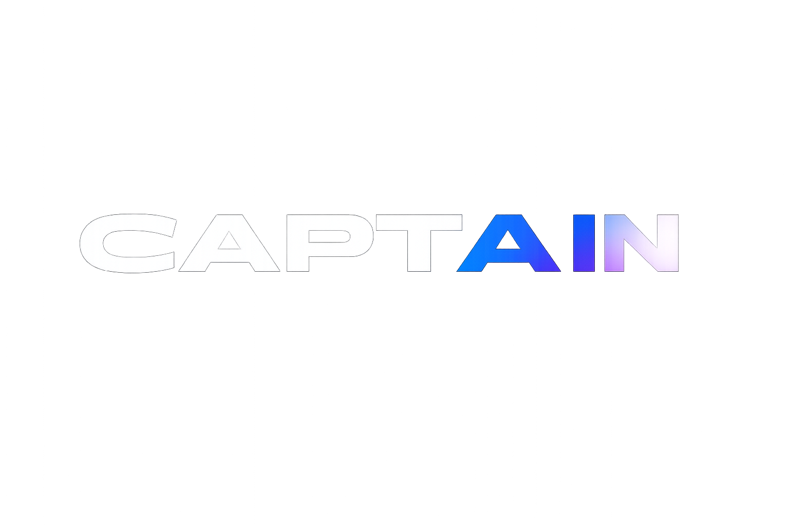
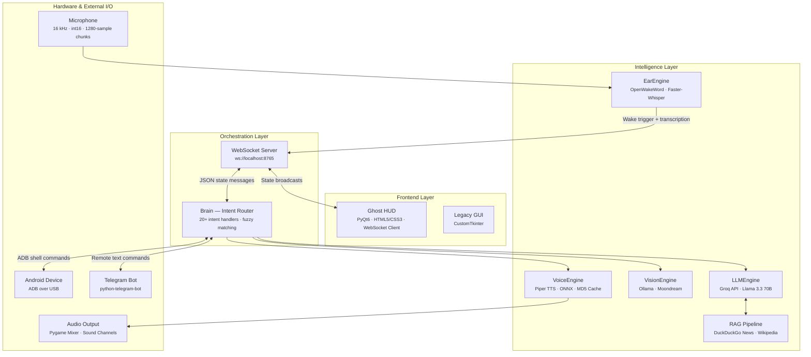
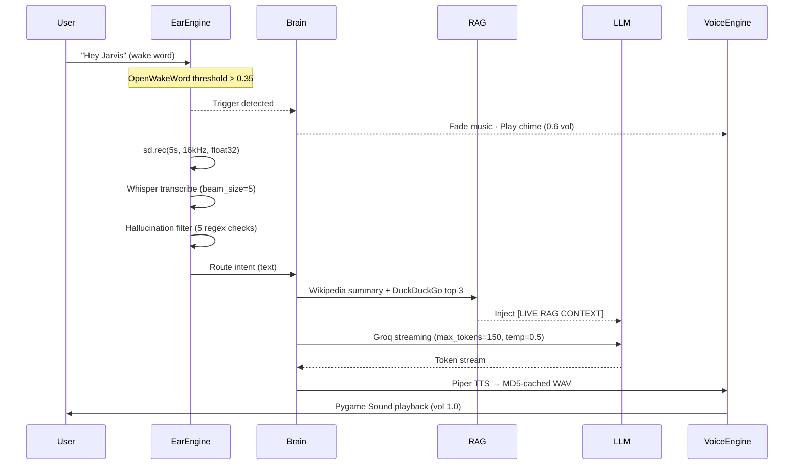
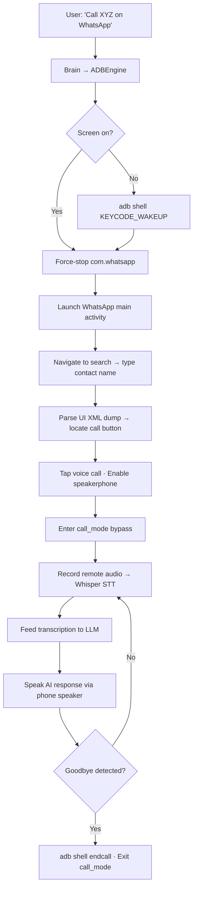
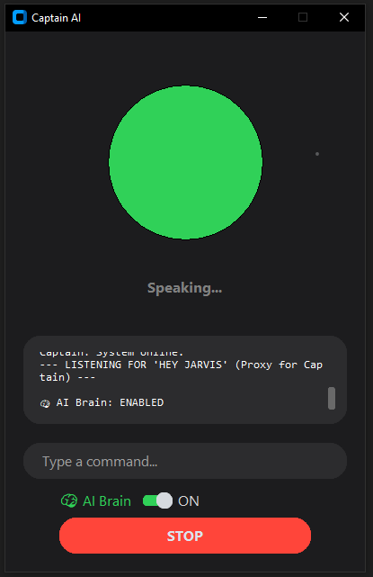
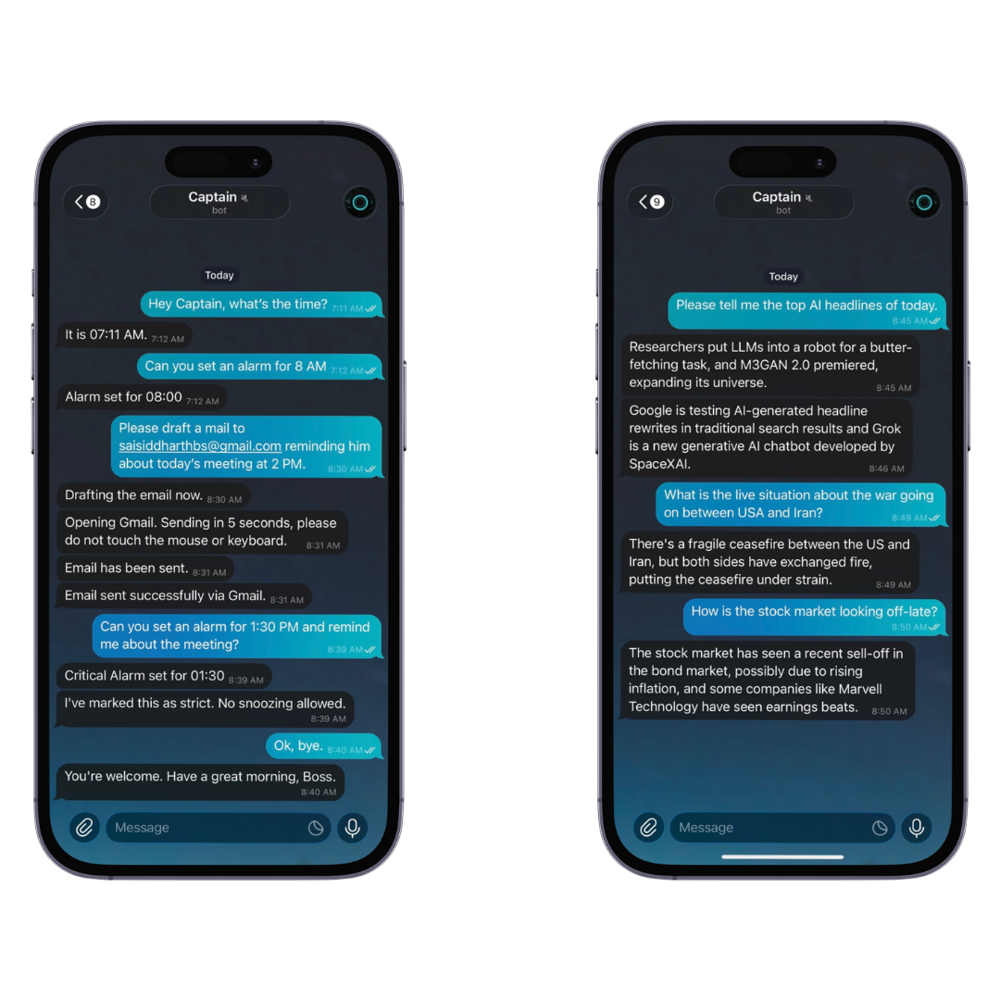

<div align="center">



### *The Sentinel Engine*

[](https://www.python.org/downloads/)
[]()
[]()
[](https://groq.com)
[](https://ollama.com)
[]()
[]()
[]()

---

A modular, voice-activated AI assistant engineered for local-first execution.<br>
Combines real-time STT/TTS pipelines, hybrid RAG retrieval, screen-aware vision inference,<br>
Android device automation via ADB, and a WebSocket-driven HUD overlay —<br>
all orchestrated through a single intent-routing engine.

[Quick Start](#-quick-start) · [Architecture](#-system-architecture) · [Features](#-feature-matrix) · [Tech Stack](#-technology-stack) · [Screenshots](#-media--demonstrations) · [Setup](#-setup--deployment) · [Privacy](#%EF%B8%8F-the-sovereign-data-doctrine)

**Website - captain-wheat.vercel.app**

</div>

<br>

## 🚀 Quick Start

```bash
# 1. Clone
git clone https://github.com/SaiSiddharthBS/Captain_AI.git
cd Captain_AI

# 2. Configure API keys
#    Edit config.json → insert your Groq API key and (optional) Telegram bot token

# 3. One-command launch (creates venv, installs deps, downloads models, starts app)
run_v2.bat

# 4. Summon the Ghost HUD overlay
#    Press: Ctrl + Shift + Space
```

> **Minimum Requirements:** Python 3.10+, Windows 10/11, ~2 GB disk (models + dependencies), microphone input.

---

## 🏗 System Architecture

### High-Level Block Diagram

The system follows a **hub-and-spoke architecture** with the `Brain` class acting as the central intent router. All I/O subsystems — audio capture, speech synthesis, vision, LLM inference, and device control — are initialized as independent engine instances and orchestrated through a single `process_input()` → `_route_intent()` dispatch pipeline.



### Audio & Cognition Pipeline

End-to-end latency from wake word detection to spoken response:



### WhatsApp Phone Bridge Automation

Fully autonomous call initiation, conversation, and hangup — zero human intervention:



---

## 🎯 Feature Matrix

| Category | Feature | Implementation Detail |
|:---|:---|:---|
| **Voice Pipeline** | Wake word detection | `OpenWakeWord` · `hey_jarvis_v0.1` · ONNX inference · configurable sensitivity threshold |
| | Speech-to-text | `faster-whisper` · `base` model · int8 quantization · CPU · beam_size=5 |
| | Text-to-speech | `Piper TTS` · `en_US-ryan-medium` ONNX model · MD5-hashed WAV cache with startup pre-warming |
| | Hallucination filter | 5-stage regex pipeline: no-speech probability > 0.6, symbol-only, char-repeat ≥ 5, bracket junk, min-length < 2 |
| **LLM Cognition** | Conversational AI | `Groq API` · `llama-3.3-70b-versatile` · streaming responses · max_tokens=150 · temperature=0.5 |
| | Live RAG injection | Wikipedia summary (top 1 result, 2 sentences) + DuckDuckGo News (top 3 snippets) injected as `[LIVE RAG CONTEXT]` into system prompt |
| | System prompt | Enforces concise voice-assistant behavior: 1–2 sentences, no markdown, factual-only with RAG priority over training weights |
| **Screen Vision** | Screen awareness | `Ollama` · `moondream` model · PIL screenshot → 512×512 thumbnail → base64 → streaming inference |
| | Capabilities | Code summarization, image analysis, website content extraction — fully offline |
| **Device Control** | WhatsApp automation | Full ADB pipeline: wake → force-stop → launch → search contact → tap call → speakerphone → AI conversation loop → auto-hangup |
| | OS commands | Sleep, lock workstation, empty recycle bin (`ctypes` · `SHEmptyRecycleBinW`) |
| | App launcher | Maps voice commands to local executables (Chrome, VS Code, Spotify, Notepad, Calculator) and shell URIs (Mail, Calendar, Recycle Bin) |
| | Web routing | YouTube search, Google search, GitHub — with `urllib.parse` query encoding |
| **Email Automation** | Gmail compose + send | LLM drafts email body → Gmail compose URL with `view=cm` → `pyautogui` + `pygetwindow` for window focus → `Ctrl+Enter` auto-send |
| **Music Engine** | Playback | `Pygame` mixer · mood-mapped folder routing (Chill, Devotional, Workout) · fuzzy folder matching |
| | Audio ducking | Smooth fade-out (0.5s → 20% vol) during voice interaction, fade-in on completion |
| | Download | `yt-dlp` + `ffmpeg` pipeline for YouTube → MP3 conversion |
| **Memory** | Persistent storage | JSON-backed (`data/memory.json`) — facts, preferences, and to-do lists with add/list/clear operations |
| | Alarms & timers | JSON-backed (`data/alarms.json`) — HH:MM scheduling, snooze logic with rejection limits, urgent-mode (no-snooze for meetings/flights) |
| **Remote Access** | Telegram bot | `python-telegram-bot` daemon · bidirectional text command interface · LLM responses relayed back to mobile |
| **Ghost HUD** | Overlay UI | Frameless PyQt6 window · HTML5/CSS3 with liquid aurora mesh gradients · glassmorphism backdrop blur |
| | State visualization | Contextual glow: Cyan (Listening) · Deep Blue (Processing) · Green (Speaking) |
| | IPC | WebSocket client → `ws://localhost:8765` · JSON message protocol · async state broadcasts |
| | Activation | Global hotkey: `Ctrl+Shift+Space` · system tray icon via `pystray` |
| **Promotional Frontend** | Awwwards-grade Site | GSAP-powered cinematic scroll animations, Lenis smooth scrolling, liquid mesh gradients, and magnetic custom cursors |

---

## 🛠 Technology Stack

<table>
<tr><th>Layer</th><th>Technology</th><th>Role</th><th>Specification</th></tr>
<tr><td rowspan="3"><b>Inference</b></td>
    <td>Groq Cloud API</td><td>Primary LLM</td><td><code>llama-3.3-70b-versatile</code> · streaming · 150 token cap</td></tr>
<tr><td>Ollama</td><td>Local vision model</td><td><code>moondream</code> · 512×512 input · streaming</td></tr>
<tr><td>ONNX Runtime</td><td>Wake word + TTS inference</td><td>CPU-optimized runtime for OpenWakeWord and Piper</td></tr>
<tr><td rowspan="3"><b>Audio</b></td>
    <td>Faster-Whisper</td><td>Speech-to-text</td><td><code>base</code> model · int8 quantization · CPU · beam_size=5</td></tr>
<tr><td>Piper TTS</td><td>Text-to-speech</td><td><code>en_US-ryan-medium</code> · ONNX · MD5 WAV caching</td></tr>
<tr><td>OpenWakeWord</td><td>Always-on trigger</td><td>16 kHz stream · 1280-sample chunks · <code>hey_jarvis_v0.1</code></td></tr>
<tr><td rowspan="2"><b>RAG</b></td>
    <td>DuckDuckGo (ddgs)</td><td>Live news retrieval</td><td>Top 3 results · 10s timeout · no proxy</td></tr>
<tr><td>Wikipedia</td><td>Entity resolution</td><td>Top 1 search result · 2-sentence summary</td></tr>
<tr><td rowspan="3"><b>I/O</b></td>
    <td>Pygame</td><td>Audio playback</td><td>Mixer channels for TTS + Music · volume ducking</td></tr>
<tr><td>sounddevice</td><td>Microphone capture</td><td>16 kHz · 1 channel · int16 · streaming callback</td></tr>
<tr><td>ADB (Android Debug Bridge)</td><td>Phone automation</td><td>Shell commands · UI XML dump parsing · input tap/text</td></tr>
<tr><td rowspan="2"><b>Frontend</b></td>
    <td>PyQt6 + HTML5/CSS3</td><td>Ghost HUD overlay</td><td>Frameless window · glassmorphism · aurora mesh CSS</td></tr>
<tr><td>WebSockets</td><td>IPC protocol</td><td><code>ws://localhost:8765</code> · JSON state messages</td></tr>
<tr><td rowspan="2"><b>Automation</b></td>
    <td>PyAutoGUI + PyGetWindow</td><td>Desktop automation</td><td>Gmail compose → Ctrl+Enter send · window focusing</td></tr>
<tr><td>ctypes</td><td>Win32 API calls</td><td>Recycle bin · workstation lock · sleep/suspend</td></tr>
</table>

---

## 📸 Media & Demonstrations

### System Interface Screenshots

<div align="center">

*Promotional Frontend — An Awwwards-grade, GSAP-powered website featuring cinematic scroll animations, Lenis smooth scrolling, liquid mesh gradients, and magnetic custom cursors.*
<br>


---

*Phase 1 — Lightweight GUI prototype featuring real-time terminal logs, modular toggle controls, and the core voice-activated listening loop.*
<br>


---

*Ghost HUD — An Apple Dynamic Island-inspired, frameless cyberpunk overlay summoned via global hotkey, with real-time screen awareness and voice-activated AI at the top of your screen.*
<br>


---

*Telegram Integration — A fully remote, Llama-powered mobile interface that puts Captain AI in your pocket — answer questions and execute system commands on the go.*
<br>


</div>

### Video Demonstrations

<div align="center">

*Gmail Automation Demo — Voice-commanded email drafting, composition, and auto-send via LLM + PyAutoGUI.*
<br>

https://github.com/SaiSiddharthBS/Captain_AI/raw/main/assets/demo_gmail.mp4

</div>

---

## 📁 Project Structure

```
Captain_AI/
├── src/                            # Core application source
│   ├── brain.py                    # Central intent router (720 LOC · 20+ handlers)
│   ├── llm.py                      # Groq API client · RAG injection · streaming
│   ├── stt.py                      # EarEngine: wake word + Whisper STT + hallucination filter
│   ├── tts.py                      # VoiceEngine: Piper TTS + MD5 WAV cache
│   ├── vision.py                   # VisionEngine: Ollama moondream · screenshot → inference
│   ├── server.py                   # WebSocket server (ws://localhost:8765) + engine init
│   ├── tools.py                    # OS automation · app launcher · web search · Gmail compose
│   ├── adb_tools.py                # Android ADB automation (WhatsApp call pipeline)
│   ├── telegram_engine.py          # Telegram bot daemon (python-telegram-bot)
│   ├── memory.py                   # JSON-backed persistent memory (facts, todos, prefs)
│   ├── alarm.py                    # Alarm & timer engine with snooze logic
│   ├── music.py                    # Pygame music player with folder routing & ducking
│   ├── hud.py                      # Ghost HUD: PyQt6 frameless overlay + WebSocket client
│   ├── gui.py                      # Legacy V7 CustomTkinter GUI
│   └── config.py                   # Path constants (BASE_DIR, MODELS_DIR, MEDIA_DIR, DATA_DIR)
├── models/                         # AI model artifacts (auto-downloaded by setup_v2.py)
│   ├── piper/                      # Piper TTS binary + en_US-ryan-medium.onnx voice model
│   └── models--Systran--faster-whisper-base/
├── data/                           # Runtime persistent storage
│   ├── memory.json                 # User facts, preferences, and to-do items
│   └── alarms.json                 # Scheduled alarms with urgency flags
├── media/                          # Audio assets
│   ├── cache/                      # MD5-hashed TTS WAV files (auto-generated)
│   └── sounds/                     # System chimes and alert tones
├── bin/                            # System binaries (ffmpeg, ffprobe)
├── tools/                          # Developer utilities
│   ├── auto_info_ollama.py         # Silent Ollama model installer
│   ├── downloader.py               # yt-dlp → MP3 downloader
│   └── make_chime.py               # Sine-wave chime generator
├── website/                        # Static promotional frontend (HTML5/CSS3/JS)
├── config.json                     # User configuration (API keys, wake sensitivity, volume)
├── main.py                         # Entry point — V7 GUI mode
├── main_v10.py                     # Entry point — V10 Ghost HUD + WebSocket server
├── run_v2.bat                      # One-click bootstrap (venv + deps + models + launch)
├── setup_v2.py                     # Automated model downloader (Piper TTS binary + ONNX voice)
└── requirements.txt                # Python dependency manifest
```

---

## ⚙ Setup & Deployment

### Prerequisites

| Requirement | Minimum | Notes |
|:---|:---|:---|
| Python | 3.10+ | Must be on `PATH` |
| OS | Windows 10/11 | macOS support in progress |
| Disk | ~2 GB | Models + venv + audio cache |
| Microphone | Any USB/built-in | 16 kHz capture via `sounddevice` |
| Groq API Key | Free tier | [console.groq.com](https://console.groq.com) |
| ADB (optional) | Platform Tools v34+ | Only for Android device automation |
| Ollama (optional) | Latest | Only for local vision (`moondream` model) |

### Installation

```bash
# 1. Clone the repository
git clone https://github.com/SaiSiddharthBS/Captain_AI.git
cd Captain_AI

# 2. Insert API credentials
#    Open config.json and set:
#    {
#        "groq_api_key": "gsk_...",
#        "telegram_token": "YOUR_BOT_TOKEN"  ← optional
#    }

# 3. Bootstrap everything (recommended)
run_v2.bat
#    Creates venv → pip install -r requirements.txt
#    Runs setup_v2.py → downloads Piper TTS binary + en_US-ryan-medium ONNX voice
#    Launches the application

# 4. Or manually start the V10 Ghost HUD
venv\Scripts\python main_v10.py
#    Press Ctrl+Shift+Space to summon the overlay
```

### Optional Components

```bash
# Install Ollama for local vision (screen analysis)
python tools/auto_info_ollama.py
ollama pull moondream

# Install ffmpeg for YouTube → MP3 downloads
python install_ffmpeg.py
```

### Configuration Reference

| Key | Type | Default | Description |
|:---|:---|:---|:---|
| `groq_api_key` | string | — | Groq API key for Llama 3.3 70B inference |
| `telegram_token` | string | — | Telegram Bot API token for remote access |
| `wake_word_sensitivity` | float | `0.35` | OpenWakeWord detection threshold (0.0–1.0) |
| `default_volume` | float | `1.0` | Default music playback volume |
| `voice_rate` | int | `150` | TTS speech rate |
| `user_name` | string | `"Boss"` | Personalized greeting name |
| `alarm_folders` | list | `["Chill","Devotional"]` | Music folders used for alarm tones |

---

## 🛡️ The Sovereign Data Doctrine

Captain AI operates under strict data sovereignty principles:

| Principle | Implementation |
|:---|:---|
| **No telemetry** | Zero analytics, tracking, or data harvesting — by design, not policy |
| **Local-first storage** | All memory, alarms, and preferences stored as plain JSON on disk (`data/`) |
| **Modular inference** | STT, TTS, and wake word run entirely on-device; LLM defaults to Groq Cloud but is swappable to local Ollama in `src/llm.py` |
| **No training on your data** | Groq's inference API does not retain or train on input data |
| **Air-gapped capable** | With Ollama as LLM backend, the entire system operates without internet |

---

## 🗺 Roadmap

- [ ] Custom wake word training (`"Hey Captain"` via OpenWakeWord fine-tuning)
- [ ] macOS + Linux cross-platform support
- [ ] Multi-turn conversation memory with context windowing
- [ ] Plugin architecture for third-party tool integration
- [ ] Local LLM fallback via Ollama (Llama 3.1 8B quantized)
- [ ] Voice cloning support via custom Piper ONNX training
- [ ] CI/CD pipeline with automated integration tests

---

## 🤝 Contributing

Contributions are welcome. Please follow these guidelines:

1. **Fork** the repository and create a feature branch (`git checkout -b feature/your-feature`)
2. **Commit** with clear, descriptive messages
3. **Test** your changes locally with both `main.py` (GUI mode) and `main_v10.py` (HUD mode)
4. **Submit** a pull request with a description of what you changed and why

For bug reports, please include: OS version, Python version, full error traceback, and `config.json` structure (redact API keys).

---

<div align="center">

<sub>Engineered with precision · Captain AI · 2026</sub>

</div>
